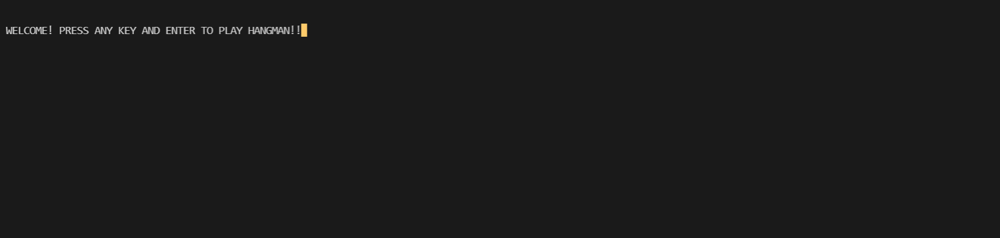
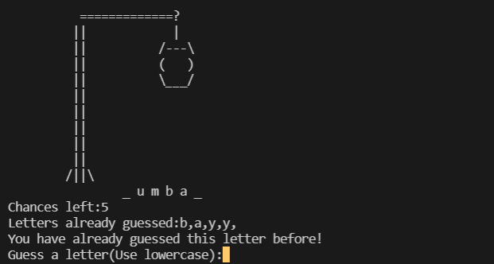
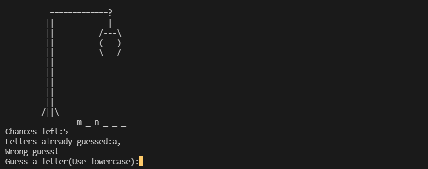
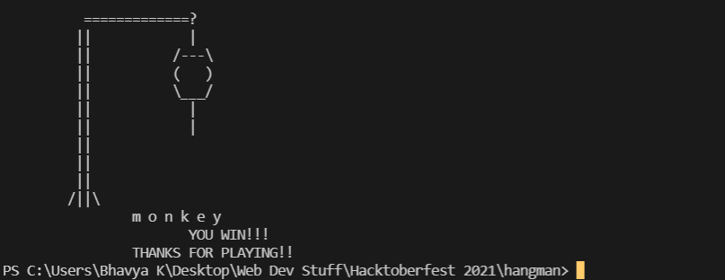
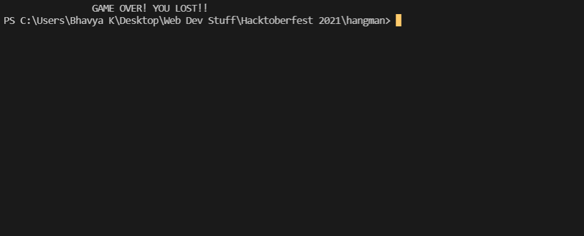

# Hangman

Through the game, hangman, we hope that the user gets to learn several new words, and improve his/her vocabulary. Each time he/she comes across a new word, he'll/she’ll be tempted to check its meaning, and put it in use as he interacts with the language. This game will also help the user know where their vocabulary stands, and how much they have to improve it, as all the words used are very basic and are used commonly. Enjoy!

# Images

<h3>Welcome</h3>

<h3>Start</h3>

<h3>Repeat</h3>

<h3>Wrong Guess</h3>

<h3>Win</h3>

<h3>Loss</h3>

